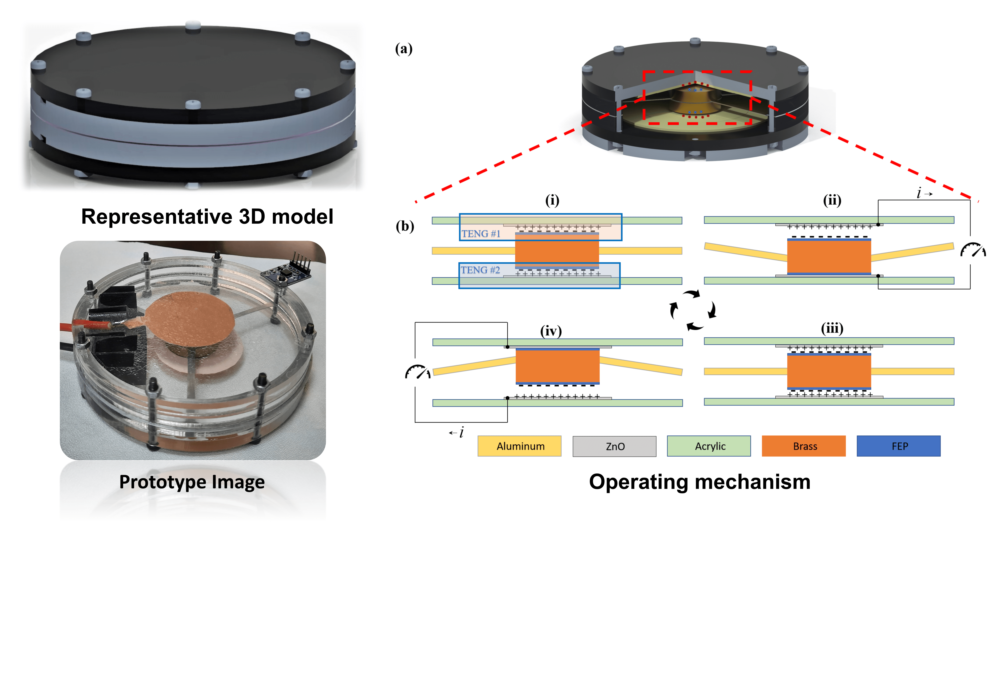

<h3>1. Abstract </h3>

 Here, we report a vibration sensor based on a single-electrode mode triboelectric nanogenerator (TENG). The main objective of this study is to develop a vibration sensor (architecture) that can be employed in any application with minor design changes to meet individual objectives. Hence, a cantilever-based vibration system is selected, which offers optimum design control in fine-tuning the sensor to operate in the desired frequency spectrum. The cantilever's proof mass is suspended by isotropic linear elastic material constituting a scalable and tunable cantilever–mass system. The oscillations create contact separation between the triboelectric-active layers (i.e. fluorinated ethylene–propylene copolymer and screen-printed zinc oxide), which develop triboelectric waveforms. This voltage waveform is used for both sensing and powering mechanisms. At resonance, the device produces peak-to-peak voltage, short-circuit current, and power density of 25 V, 10 µA, and 1.38 W m−2, respectively. To measure the influence of change in cantilever properties, we varied the number of cantilevers and evaluated the sensor performance. The sensor is reliable with >99% accuracy in a broad frequency range of 0–400 Hz. The sensor exhibits a maximum sensitivity of 14 V g−1 and can charge a 1 µF capacitor to 2.75 V in &lt; 150 s. The sensor is further tested on a lab-scale vacuum pump with known (induced) faults to estimate the sensor's competence in detecting the machinery faults. Considering the market acceptability, the sensor is developed with established manufacturing techniques such as screen-printing, and laser cutting. This study hopes to bridge the lab-to-market gap for TENG-based (vibration) sensors. 

<h3>2. The sensor design </h3>

<h3>3. Sensor fabrication </h3>

<h3>4. Sensor testing </h3>

<h3>5. Fault detection in a vacuum pump using TENG vibration sensor </h3>

<b>For detailed investigation report, please refer the main article:</b>

Self-powering vibration sensor based on a cantilever system with a single-electrode mode triboelectric nanogenerator  
<b>Sagar Hosangadi Prutvi</b>, Mallikarjuna Korrapati, and Dipti Gupta\*  
<i> Measurement Science and Technology </i> 33 (7), 075115 (2022)  
<a href='https://iopscience.iop.org/article/10.1088/1361-6501/ac5b2b/meta'> https://doi.org/10.1088/1361-6501/ac5b2b </a>
