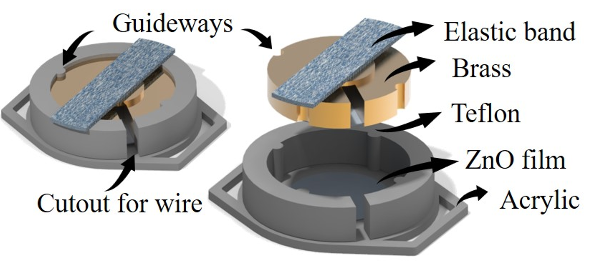
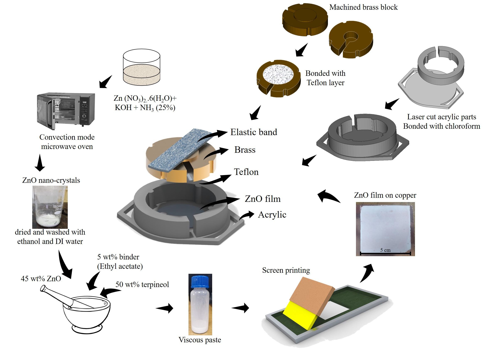
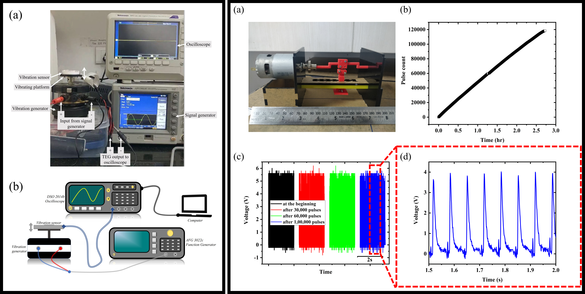
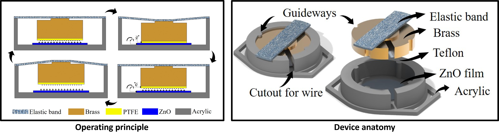
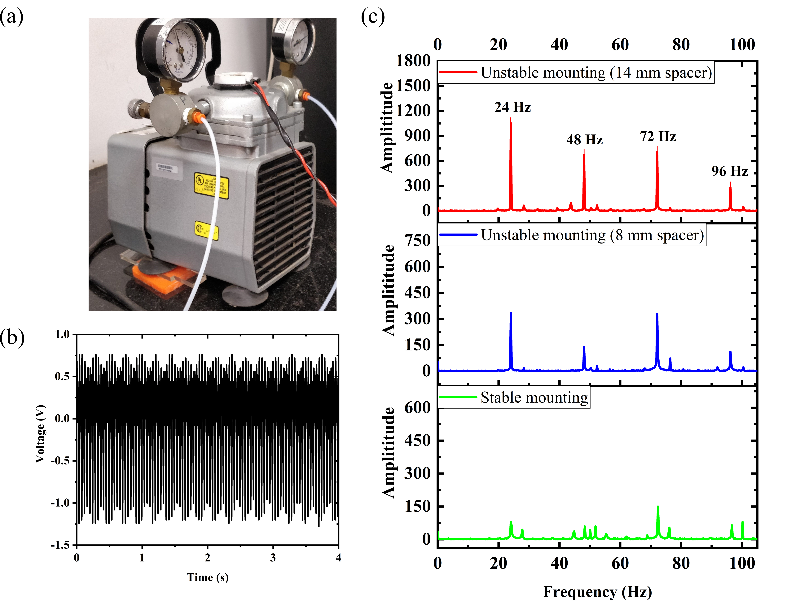

<h3>1. Abstract </h3>

 This article showcases a compact self-powered contact-mode triboelectric (TE) phenomenon-based vibration sensor for predictive maintenance of industrial machinery. The sensor has a suspended proof-mass that oscillates under external vibration and causes contact-separation between Teflon and zinc oxide (ZnO) films creating tribo signals, which are used for both sensing and powering mechanisms. For these sensors to be implemented in real-time applications, the sensor must be cost-effective, reliable, and repeatable. Hence, the active layer (ZnO film) is fabricated by an efficient process of microwave-assisted thermal decomposition followed by the established screen printing method. The sensor operates up to 400 Hz and is highly robust with no significant decay in signal strength even after 120 000 cycles tested at elevated stress values. The device produces a maximum voltage (V) of ±30 V, short circuit current of ±3 μA, and can deliver a maximum power density of 0.5 W m−2, at 8 MΩ load resistance. In the frequency domain, the device generates a maximum V at 55 Hz and can charge 1 µF capacitor to 3.5 V in 25 s. To demonstrate the functionality of the sensor in a real application, it is implemented on a lab-scale vacuum pump to capture the system faults by analyzing the harmonic signatures. Thus, in this article, we have showcased end-to-end development of the sensor from material synthesis to device testing along with its signal processing techniques and proved that the sensor can readily be implemented in industrial environments as is. This article thus emphasis bridging the lab-to-market gap for TE devices as a self-powering sensor.

<h3>2. Device schematic</h3>

<h3>3. Fabrication methodology</h3>

<h3>4. Prototype testings</h3>

<h3>5. Working principle and detailed device</h3>

<h3>6. Labscale testing on a 1/8 hp vacuum pump</h3>

<b>For detailed explaination and investigation report, please refer the main article:</b>

Triboelectric effect based self-powered compact vibration sensor for predictive maintenance of industrial machineries 
<b>Hosangadi Prutvi Sagar</b>, Sunil Meti, Udaya K Bhat, and Dipti Gupta\*  
<i>Measurement Science and Technology </i> 32 (9), 095119 (2021)  
<a href='https://iopscience.iop.org/article/10.1088/1361-6501/abe6d2/meta'> https://doi.org/10.1088/1361-6501/abe6d2 </a>
