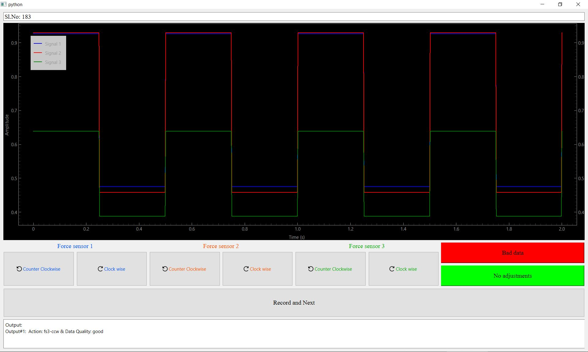
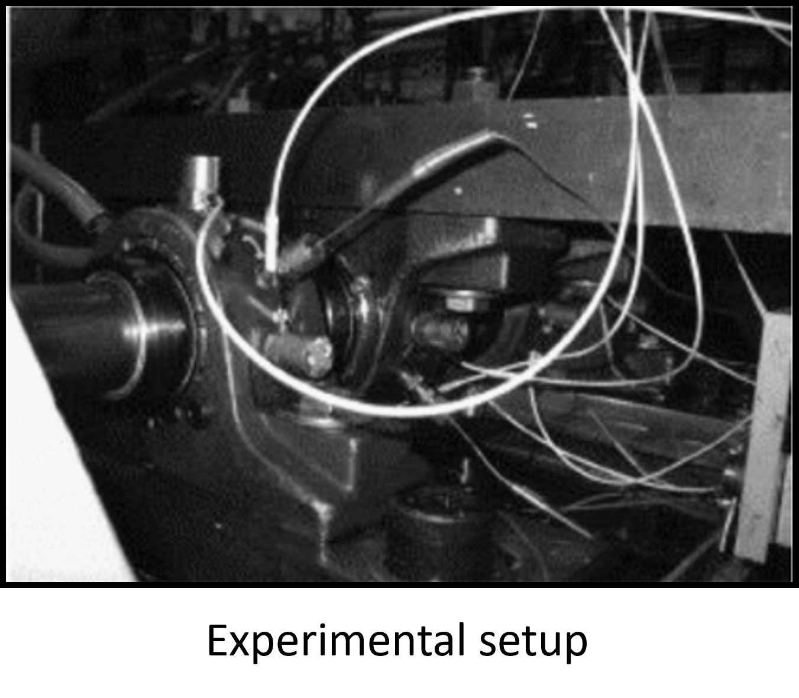
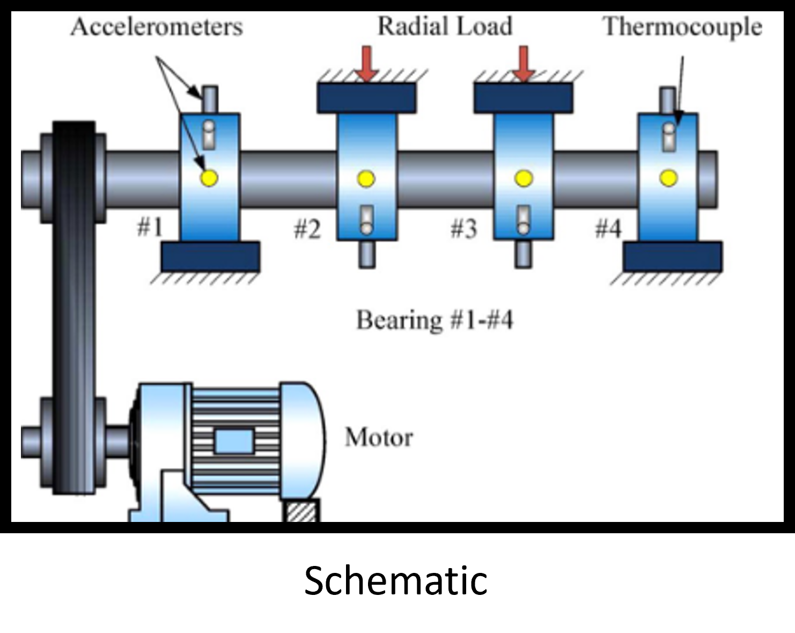
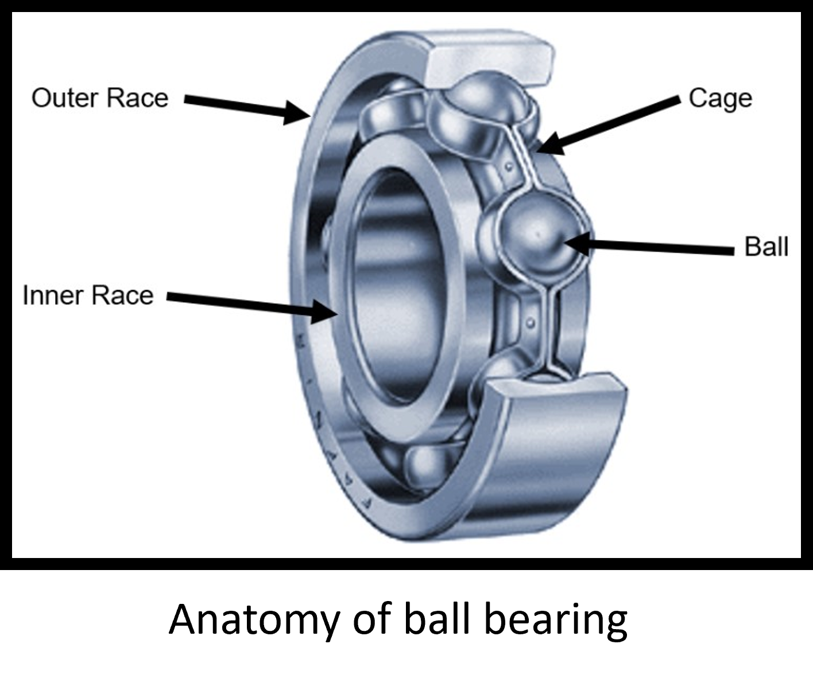
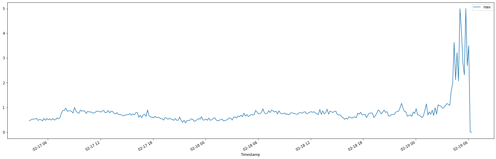
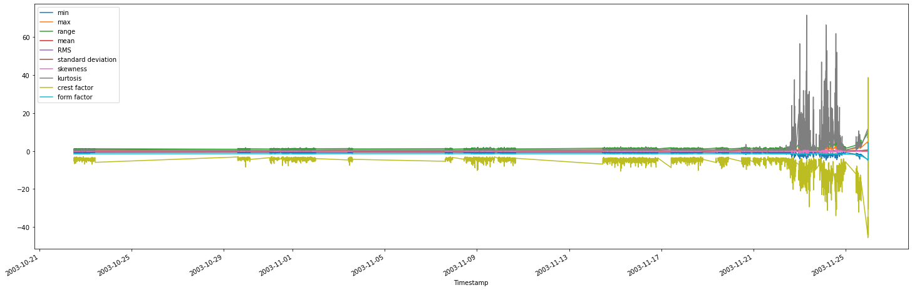
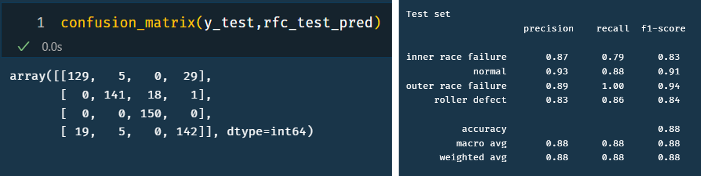

<h3> Abstract </h3>

Triboelectric devices operate on interfacial phenomenon and hence are extremely sensitive to surface area changes. Since continuous contact separation is required for TENG devices, ensuring the interating surfaces parallel is critical to extract maximum power output.

In our experimental setup, 3 force sensors are implmented behind the stationary surface, and using micro-adjustments, carefully allign the surfaces. Alignment is achieved when all the force sensors reads same force. This careful adjustment is tedious and requires multistep signal processing (translating analog readout into force) before implementing next iteration, thereby making it unfeasible for multiple experiments. This complicated workflow leads to human errors and can be difficult for untrained hands.

The objective of this system is to reduce this complications and provide a clear single text instruction based on real-time sensor data and improve the process. Since the setup has 3 force sensors, which balance the tribo active surface, Each of these force sensors can be moved forward or backward at micro meter scale using micro screws placed behind them. This means, that the user has 6 permutations to adjust the position of each microscrew (2 for each microscrew). 

<h3> Data </h3>

The data from the experiments, is a square wave pattern and is characterised by its pulse height and pulse width(load cycle). We treated the pulse width(loading cycle) as 50% as its not consequential to our ML model. While the pulse height is very critical to our operations. To build the ML model compatible data, we collected the data from 3 force sensors, extracted its meaningful info (i.e., its pulse height) and saved against the timestamp, there by saving its critical information without loosing its trend in time domain.

This developed a columnar data with 3 different sensors against its timestamp. The required user action is converted into multi class numeric column, and each number (1 to 6) represents different user action. It should be noted that, beyond the 6 user actions 2 more classes are added one for 'good data' and other for 'Bad data' to make data compatible for ML modeling.

The data signature are as follows:
1. Timestamp
2. FS1 height
3. FS2 height
4. FS3 hieght
5. User action (target column) -> categorical

However, to compile the required amount of data for ML modeling, we generated data from multiple sources.

To generate the data required for building the ML model, we used multi prong approach to gathered sufficient data, 
The required data are collected in two parts namely:
1. Experimental data
2. Synthetic data

<h3> Experimental data </h3>
Initially, we conducted the controlled tests to collect the required data for building ML model. The objective was to understand the model signature and identify the scope of ML requirements. With the set of prior data gathering, we identified the optimal model to be classifier model and frooze the number of categories.

<h3>Synthetic data</h3>
Since the manual experimentations are tedious and very difficult to generate, and ML modeling requires large amount of data to generate pattern and learn from it,  synthetic (but stastically acceptable) data is generated. This synthetic data is generated using the required stastical parameters extracted from the experimental data, and ensured to have enough data for each categories. About, 100 data points were generated for each of the classes. The datapoints was programatically generated using custom built python function, but without the user action column. Then a seperate python application was developed, which pulled this random data and recreated the force sensor output. This render was tagged (i.e., human required action) was tagged against each of this set of data manually from the human experts who manually tagged the data previously, ensuring that the data now contains human input. this process expedites the input data required for the ML model and then tagged with human experts. The image of the applicaition developed is shown below.

<h3>ML models</h3>

<!-- Source: <a href="https://github.com/hprutvisagar/IMX_bearing_dataset.git">hprutvisagar/IMX_bearing_dataset</a> -->

<!-- This IMX_bearing dataset is an extensive data set comprising of unstructured data from run-to-failure experiments of a ball bearing. This data has readings from 4 different sensors. The failure modes are recorded and attributed to each experiment. My objective is to use this sensor readings and predict the failure modes.

Here, the failure prediction can be accomplished in two ways. (1) A binary classification method, which can predict weather or not failure has occured or not & (2) A multiclass classification predicting the failure mode. Considering the obvious advantage of the second method, I have built ML model for multiclass failure mode prediction.

Before the actual datascience workflow, to better understand the problem statement and the physical significance of the data, let us first have a look at how the data is captured.

<h3> Experimental setup </h3>

Four bearings were installed on a shaft. The rotation speed was kept constant at 2000 RPM by an AC
motor coupled to the shaft via rub belts. A radial load of 6000 lbs is applied onto the shaft and bearing
by a spring mechanism. All bearings are force lubricated. 

Rexnord ZA-2115 double row bearings were installed on the shaft as shown in experimental setup. PCB 353B33
High Sensitivity Quartz ICP accelerometers were installed on the bearing housing (two accelerometers
for each bearing [x- and y-axes] for data set 1, one accelerometer for each bearing for data sets 2 and 3).
Sensor placement is also shown in schematic. All failures occurred after exceeding designed life time of
the bearing which is more than 100 million revolutions.

  
  
  

<h2> Data science workflow </h2>

Here, we have translated the unstructured time domain sensor data into a structured data by extracting the statistical information. We then label the time stamped stastical data with corresponding failure modes, and then balance the data to create a single dataset for further processing.

<h4>EDA</h4>

<h4>Data preprocessing</h4>

<h4>Fault identification and labelling</h4>

with proper fault identifications, we then create ML model. Here we have chosen random forest classifier to predict the failure. The obtained model has an accuracy of 88%. Its detailed confusion matrix is given below:

  

Source: <a href="https://github.com/hprutvisagar/IMX_bearing_dataset.git">hprutvisagar/IMX_bearing_dataset</a> -->
