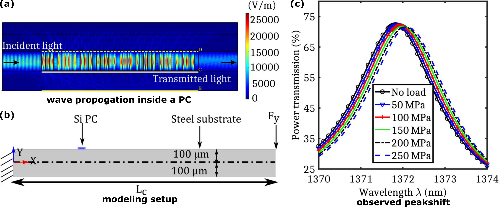

<b>Abstract <b>

 This paper presents a new type of one-dimensional photonic crystal (PC) waveguide sensor and a technique for prediction of transient strain response accurately. The PC waveguide is integrated on a silicon substrate. We investigate
the effect of non-uniform strain localization on the optical signal and use that information to capture the transient strain. Wavelength shift due to distributed strain field is modeled by incorporating the mechanically deformed geometry and photo-acoustic coupling through Pockels effect in a finite element formulation.We demonstrate the advantages of using our proposed method, where multiple spectral peak shift is used instead of single peak shift in order to improve sensing output accuracy and also to estimate the sensor parameter regressively, where the signal’s bandwidth is limited. The maximum sensitivity of the waveguide sensor in terms of wavelength shift is estimated to be 0.36 pm/μstrain in single-peak-based sensing, whereas the proposed adaptive multispectral estimation scheme shows an enhanced sensitivity of 4.029 pm/μstrain.

<b>summary</b>

At the heart of this scientific report, we couple the optical properties of silicon and mechanical strain. Then use this coorelation to extract the strain on the surface using photonic transmission bands (photonic crystal is a unique architecture, which redistributes the optical energy, and allows only specific frequencies to pass. The band transmission is a complex phenomenon, which depends on multiple factors such as input frequency, alternating materials, crystal orientation and so on.)

<b>For detailed investigation report, please refer the main article:</b>

Transient dynamic distributed strain sensing using photonic crystal waveguides  
<b>Hosangadi Prutvi Sagar</b>, Vignesh Mahalingam, Debiprosad Roy Mahapatra\*, Gopalkrishna Hegde, Sathyanarayana Hanagud, and Mohammad Rizwanur Rahman  
<i>Applied Optics</i> 56 (28), 7877-7885 (2017)
<a href='https://opg.optica.org/ao/abstract.cfm?uri=ao-56-28-7877'> https://doi.org/10.1364/AO.56.007877 </a>
