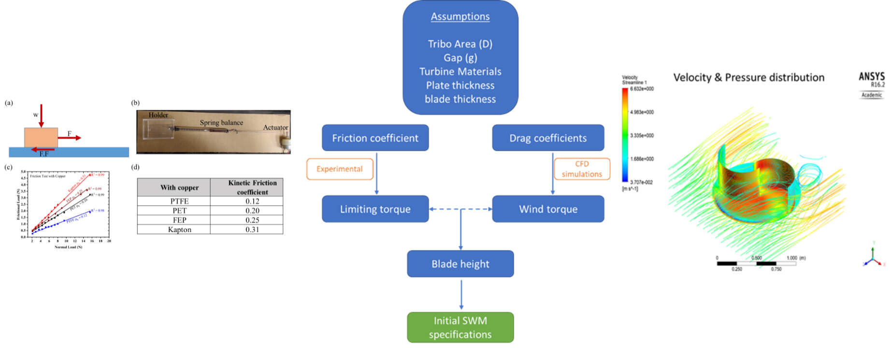
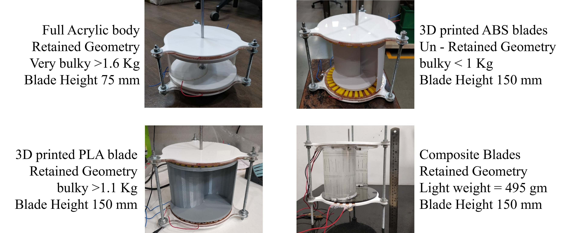
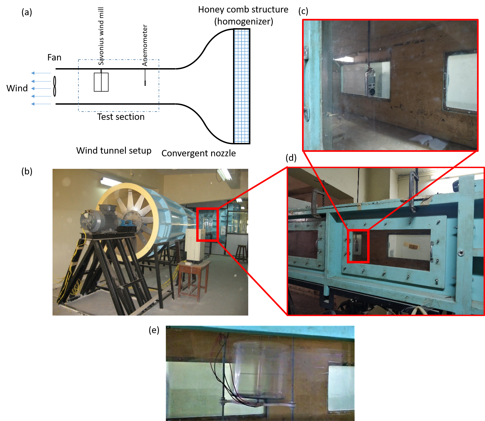
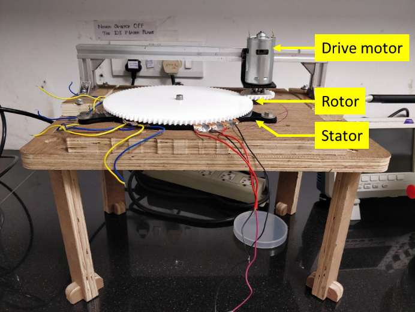

<h3>1. Introduction </h3>

  With the rapid growth in portable, personal, and wearable electronic devices, relying on conventional
energy sources like fossil fuels, windmills, hydroelectric stations, and so on is becoming
impractical. They require large infrastructure, huge capital, and time-consuming government
policies for establishments. Over the long run, these drawbacks create a lag in the supply of
energy for the growing demands. Moreover, with the emergence of the internet of things (IoT)
applications that encompass sectors such as sensors for disease diagnostics, health monitoring,
security/surveillance, and infrastructure monitoring, sustainable and distributed power sources
become essential that can be deployed even in isolated and inaccessible environments. 

 This project tries to address this energy crisis for the larger population by developing a budgetfriendly,
sustainable, zero-emission, portable energy harvesting device which should be powerful
enough to charge a small electronic gadget, like a mobile. Developing a portable harvester
leads to a distributed energy source model. This decentralization energy harvesting not only
helps in just ambient energy harvesting but has a major contribution to the reduction of ohmic
losses incurred while transmitting the electric power over long cables. I have explored the possibilities of driving a rotary mode TENG using a savonius wind turbine. The developed wind turbine was able to power a few electronic sensors. 

<!-- 
 -->

  

<h3>2. The concept </h3>

  

<h3>3. The design approach </h3>

  

<h3>4. Prototypes developed </h3>

  

<h3>5. Wind tunnel testings </h3>

  

<h3>6. r-TENG optimization on custom built fixture </h3>

<!-- 
 -->

  

<h3>7. Summary</h3>
we utilized the triboelectric phenomenon to design and develop a savonius wind turbine
in an attempt to develop a cost-effective decentralized energy harvester to power (remote)
conventional sensors. The developed TENG-based savonius windmill could deliver a maximum
power of 500 μW and had a power conversion efficiency of 0.003 % with several operational
challenges.
